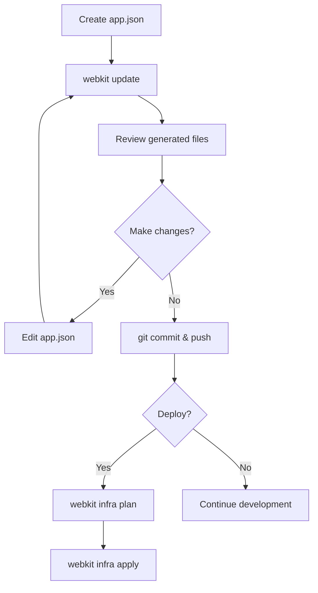

# CLI overview

WebKit provides a command-line interface for managing your entire project lifecycle—from scaffolding initial files to deploying production infrastructure.

## Command structure

All WebKit commands follow this pattern:

```bash
webkit <command> [subcommand] [flags]
```

**Examples:**
```bash
webkit update
webkit infra plan
webkit secrets encrypt secrets/production.yaml
webkit scaffold code-style
```

## Global flags

These flags work with any WebKit command:

| Flag         | Description                         | Example                  |
|--------------|-------------------------------------|--------------------------|
| `--help`     | Show help for a command             | `webkit --help`          |
| `--version`  | Display WebKit version information  | `webkit --version`       |

## Core commands

### `webkit update`

The most important command. Regenerates all project files based on your `app.json` manifest.

```bash
webkit update
```

**What it does:**
- Reads `app.json`
- Generates/updates all supporting files (workflows, environment files, configs)
- Tracks changes in `.webkit-manifest.json`
- Cleans up orphaned files from removed apps/resources

**When to use:** After creating or modifying `app.json`, run this to sync your project.

[Full documentation →](/cli/webkit-update)

---

### `webkit infra`

Manage cloud infrastructure through Terraform.

**Subcommands:**
```bash
webkit infra plan      # Preview infrastructure changes
webkit infra apply     # Deploy infrastructure
webkit infra destroy   # Tear down infrastructure
webkit infra output    # View Terraform outputs
```

**Prerequisites:**
- Terraform installed
- Cloud provider credentials exported as environment variables

[Full documentation →](/cli/webkit-infra)

---

### `webkit secrets`

Manage SOPS-encrypted secret files.

**Subcommands:**
```bash
webkit secrets scaffold   # Generate empty secret files
webkit secrets encrypt    # Encrypt a secret file
webkit secrets decrypt    # Decrypt a secret file for editing
webkit secrets sync       # Sync secrets from app.json
webkit secrets get        # Retrieve a specific secret value
webkit secrets validate   # Check secret files are valid
```

[Full documentation →](/cli/webkit-secrets)

---

### `webkit env`

Manage environment variable files.

**Subcommands:**
```bash
webkit env scaffold   # Generate .env files
webkit env sync       # Sync .env files from app.json
```

**Note:** `webkit update` automatically runs these commands, so you rarely need to call them directly.

[Full documentation →](/cli/webkit-env)

---

### `webkit cicd`

Generate GitHub Actions workflows.

**Subcommands:**
```bash
webkit cicd actions   # Generate action templates
webkit cicd backup    # Generate backup workflows
webkit cicd pr        # Generate pull request workflows
```

**Note:** `webkit update` handles this automatically.

[Full documentation →](/cli/webkit-cicd)

---

### `webkit scaffold`

Generate individual project components without running a full update.

**Subcommands:**
```bash
webkit scaffold code-style       # Generate code style configs
webkit scaffold git              # Generate Git settings
webkit scaffold package-json     # Generate root package.json
webkit scaffold cicd             # Generate CI/CD workflows
webkit scaffold pnpm-workspace   # Generate pnpm-workspace.yaml
webkit scaffold turbo            # Generate turbo.json
webkit scaffold docker-ignore    # Generate .dockerignore files
webkit scaffold secrets          # Generate secret files
webkit scaffold env              # Generate .env files
```

**Use case:** When you want to regenerate a specific file without running `webkit update` on the entire project.

[Full documentation →](/cli/webkit-scaffold)

---

### `webkit drift`

Check for configuration drift between `app.json` and generated files.

```bash
webkit drift
```

**What it checks:**
- `app.json` is valid JSON
- All required fields are present
- Resource types and providers are supported
- App dependencies reference existing resources
- No duplicate app or resource names

[Full documentation →](/cli/webkit-drift)

---

### `webkit version`

Display the current WebKit version.

```bash
webkit version
```

Output:
```
webkit version 1.0.0 (commit: abc123, built: 2025-01-15)
```

## Typical workflow

Here's how you use WebKit commands in a typical project:



### Initial setup

1. Create `app.json` in your project root
2. Run `webkit update` to generate all files
3. Set up secrets with `webkit secrets scaffold` and `webkit secrets encrypt`
4. Commit everything to Git

### Making changes

1. Edit `app.json`
2. Run `webkit update`
3. Review the changes with `git diff`
4. Commit the updated files

### Deploying

1. Export cloud provider credentials
2. Run `webkit infra plan` to preview changes
3. Run `webkit infra apply` to deploy
4. Check outputs with `webkit infra output`

### Day-to-day

Most of the time, you'll only use:
- `webkit update` - After editing `app.json`
- `webkit drift` - To validate your manifest before committing
- `webkit secrets encrypt/decrypt` - When managing secrets

CI/CD workflows handle building and deploying your apps automatically.

## Environment variables

Some commands require environment variables:

### Infrastructure commands

```bash
export TF_VAR_digitalocean_token="your-token"
export TF_VAR_b2_application_key_id="your-key-id"
export TF_VAR_b2_application_key="your-key"
```

Required before running `webkit infra plan` or `webkit infra apply`.

### Secrets management

Age encryption key location:
```bash
# Default: ~/.config/sops/age/keys.txt
export SOPS_AGE_KEY_FILE="~/my-age-key.txt"
```

## Exit codes

WebKit commands return standard exit codes:

| Code | Meaning                                      |
|------|----------------------------------------------|
| 0    | Success                                      |
| 1    | General error (check error message)          |
| 2    | Invalid arguments or flags                   |
| 3    | Validation error (manifest or configuration) |

Use these in scripts to handle errors:

```bash
if webkit update; then
  echo "Update successful"
else
  echo "Update failed with code $?"
  exit 1
fi
```

## Next steps

- **[webkit update](/cli/webkit-update)** - The most important command
- **[webkit infra](/cli/webkit-infra)** - Deploy your infrastructure
- **[webkit secrets](/cli/webkit-secrets)** - Manage secrets securely
- **[Manifest reference](/manifest/overview)** - Learn about `app.json`
