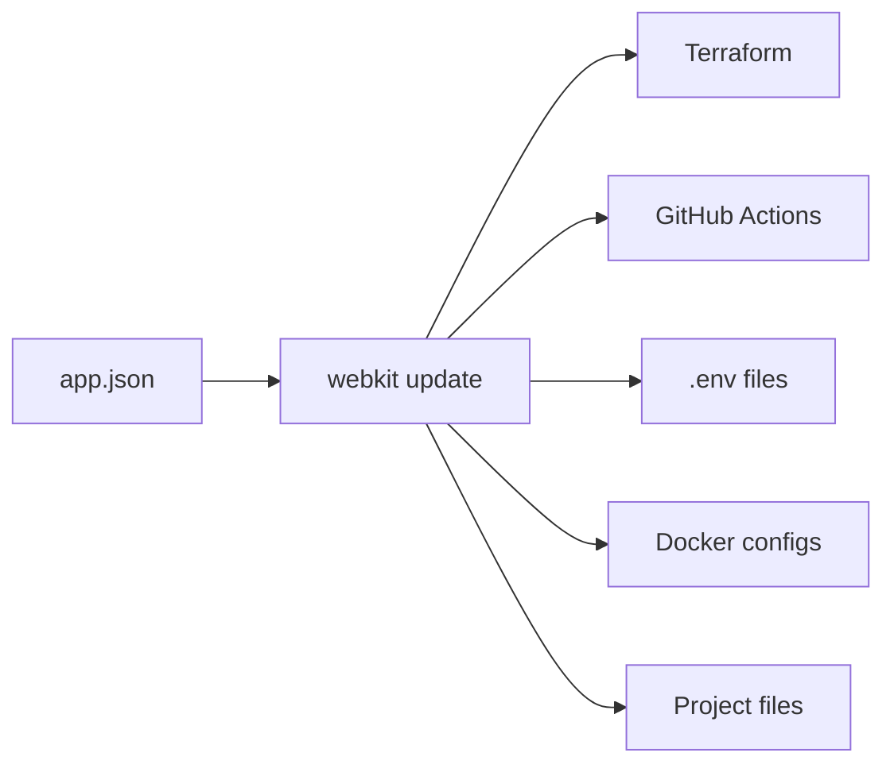
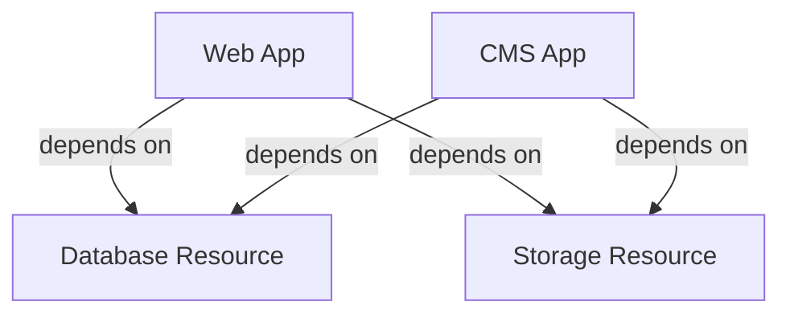
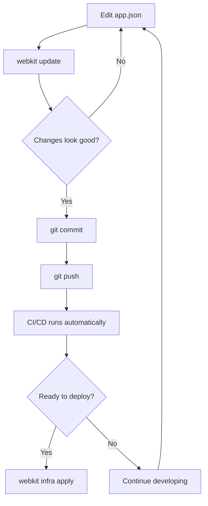

# Core concepts

WebKit is built around a few core ideas that make infrastructure management simpler, more consistent, and less error-prone. Understanding these concepts will help you get the most out of the tool.

## The manifest is the source of truth

Everything in your project—apps, resources, environment variables, infrastructure configuration—is defined in a single `app.json` file. This manifest is the authoritative source for your project structure.

When you run `webkit update`, WebKit reads this manifest and generates all the supporting files your project needs:
- Infrastructure as code (Terraform)
- CI/CD pipelines (GitHub Actions)
- Environment variable files
- Project configuration files
- Docker setup

**The key insight:** instead of maintaining dozens of configuration files across different tools and formats, you maintain one manifest. WebKit handles the translation.



## Idempotent updates

You can run `webkit update` as many times as you want. WebKit intelligently:
- Updates only what changed
- Preserves your customisations
- Cleans up orphaned files from removed apps or resources
- Avoids unnecessary file modifications

This means you can iterate freely on your `app.json` without worrying about breaking existing configuration. Add an app, run `webkit update`. Remove a resource, run `webkit update` again. WebKit handles the diff.

### How it works

WebKit maintains a `.webkit-manifest.json` file that tracks which files it generated and their source in `app.json`. On each update:

1. WebKit generates new files based on the current `app.json`
2. It compares the new manifest with the previous one
3. Files that no longer have a source (orphaned) are deleted
4. Files that changed are updated
5. Files you customised (marked in the manifest) are preserved

::: warning
Don't edit `.webkit-manifest.json` directly. This file is managed by WebKit and should be committed to version control.
:::

## Apps and resources

WebKit distinguishes between two types of infrastructure:

### Apps

Apps are your services—the code you write. They have a `path` pointing to their source code, a `type` (like `payload`, `sveltekit`, `go`), and infrastructure configuration defining how they're deployed.

Apps:
- Have source code in your repository
- Are built into Docker images
- Run as services (VMs, containers, serverless functions)
- Can depend on resources

Examples: a frontend web app, a CMS, an API service, a background worker.

### Resources

Resources are managed infrastructure components that apps depend on. They don't contain application code—they're services provided by cloud platforms.

Resources:
- Are defined by `type` (like `postgres`, `s3`, `redis`)
- Are provisioned through Terraform
- Expose outputs (connection strings, endpoints, credentials)
- Are referenced by apps through environment variables

Examples: a PostgreSQL database, an S3 bucket, a Redis cache.



## Environment-specific configuration

WebKit supports three environments out of the box:
- `dev` - Local development
- `staging` - Pre-production testing (optional)
- `production` - Live deployment

Environment variables can be defined globally in the `shared` block or per-app in each app's `env` block. WebKit merges these intelligently, with app-specific variables taking precedence.

**Example:**

```json
{
  "shared": {
    "env": {
      "production": [
        {
          "key": "NODE_ENV",
          "type": "value",
          "value": "production"
        }
      ]
    }
  },
  "apps": [
    {
      "name": "web",
      "env": {
        "dev": [
          {
            "key": "API_URL",
            "type": "value",
            "value": "http://localhost:8080"
          }
        ],
        "production": [
          {
            "key": "API_URL",
            "type": "value",
            "value": "https://api.example.com"
          }
        ]
      }
    }
  ]
}
```

WebKit generates separate `.env` files for `dev` and `.env.production` files for production, merging shared and app-specific variables.

## Secrets management

Sensitive values (API keys, passwords, tokens) are handled differently from regular environment variables. WebKit integrates SOPS (Secrets OPerationS) with Age encryption for secure, version-controlled secrets management.

**The flow:**

1. Reference secrets in `app.json` using `type: "secret"`
2. WebKit scaffolds SOPS-encrypted YAML files in `secrets/`
3. You edit these files using `webkit secrets decrypt` / `webkit secrets encrypt`
4. Encrypted files are committed to git (safe to version)
5. WebKit resolves secrets at deployment time

**Why this matters:**

- Secrets are encrypted at rest in your repository
- They can be reviewed in pull requests (encrypted form)
- Different team members can have access to different environments
- CI/CD pipelines decrypt secrets using a single Age private key

Learn more in the [environment variables documentation](/manifest/environment-variables).

## Infrastructure as code

WebKit generates Terraform configurations from your `app.json`. You don't write Terraform directly—you declare your desired state in the manifest, and WebKit produces the appropriate Terraform modules.

This approach:
- **Reduces boilerplate**: No need to copy Terraform modules between projects
- **Ensures consistency**: All projects use the same infrastructure patterns
- **Simplifies updates**: Change `app.json`, run `webkit infra plan`, apply
- **Maintains flexibility**: Generated Terraform can be customised if needed

**Provider abstraction:**

WebKit uses generic resource types (`postgres`, `s3`, `vm`, `container`) and maps them to provider-specific resources:

| Generic Type | DigitalOcean         | AWS (future)      |
|--------------|----------------------|-------------------|
| `postgres`   | Database Cluster     | RDS PostgreSQL    |
| `s3`         | Spaces (S3-compat)   | S3 Bucket         |
| `vm`         | Droplet              | EC2 Instance      |
| `container`  | App Platform         | ECS/Fargate       |

This abstraction means you can switch providers by changing the `provider` field without rewriting your infrastructure definitions.

## CI/CD automation

WebKit generates GitHub Actions workflows for:
- **Pull request checks**: Build and test apps on every PR
- **Drift detection**: Daily checks for infrastructure changes
- **Database backups**: Scheduled backups for resources
- **Deployments**: Automated deployments on merges to main

These workflows are generated based on your `app.json`. Add a new app, and WebKit creates the corresponding workflow. Remove an app, and the workflow is cleaned up.

**Custom workflows:**

You can extend or customise generated workflows. WebKit preserves modifications you make outside of tracked sections, so you can add custom steps, additional jobs, or integrate third-party actions.

## File tracking and customisation

WebKit tracks every file it generates in `.webkit-manifest.json`. Each file entry includes:
- Path
- Source (which app, resource, or project setting generated it)
- Modification tracking

When you customise a generated file, WebKit detects the change and preserves your modifications on subsequent updates. This allows you to:
- Tweak generated workflows
- Modify Terraform configurations
- Adjust environment files
- Customise project settings

**The rule:** WebKit won't overwrite files you've modified unless their source in `app.json` changes significantly.

## Dependency resolution

WebKit automatically resolves dependencies between apps and resources:

```json
{
  "apps": [
    {
      "name": "web",
      "env": {
        "production": [
          {
            "key": "DATABASE_URL",
            "type": "from_resource",
            "from": "resource:db:connection_url"
          }
        ]
      }
    }
  ]
}
```

This reference tells WebKit that:
- The `web` app depends on the `db` resource
- In Docker Compose, `web` should start after `db`
- In Terraform, the `web` deployment depends on `db` being provisioned first
- The environment variable should be populated from Terraform outputs

You don't manually define dependencies—WebKit infers them from environment variable references.

## Opinionated defaults, flexible overrides

WebKit makes decisions for you:
- Code style configurations (Prettier, EditorConfig)
- Git settings and `.gitignore` patterns
- Monorepo tooling (pnpm, Turbo)
- Terraform module structure
- Workflow naming conventions

These decisions reduce setup time and ensure consistency across projects. But you're not locked in—every generated file can be customised, and WebKit preserves your changes.

**The philosophy:** WebKit gives you a sensible starting point. You can override anything, but you don't have to.

## The WebKit workflow

Putting it all together, a typical WebKit workflow looks like:

1. **Define your project** in `app.json`
2. **Run `webkit update`** to generate all supporting files
3. **Commit changes** to version control
4. **Make changes** to `app.json` as your project evolves
5. **Run `webkit update` again** to sync changes
6. **Deploy infrastructure** with `webkit infra apply`
7. **Let CI/CD handle builds and deployments** automatically



This workflow is repeatable, predictable, and auditable. Every change goes through version control, and infrastructure updates are explicit actions.

## Next steps

Now that you understand the core concepts:

- **[Manifest reference](/manifest/overview)** - Learn every option in `app.json`
- **[CLI commands](/cli/overview)** - Explore all WebKit commands
- **[Infrastructure deployment](/infrastructure/overview)** - Deploy your project to production
- **[Your first project](/getting-started/your-first-project)** - Build a complete full-stack app
