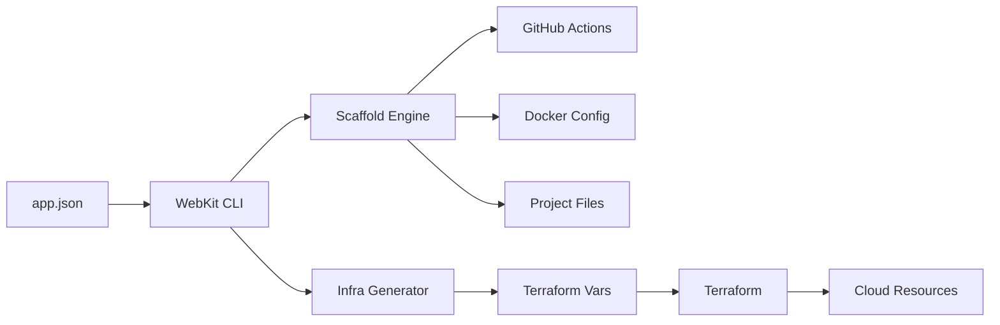
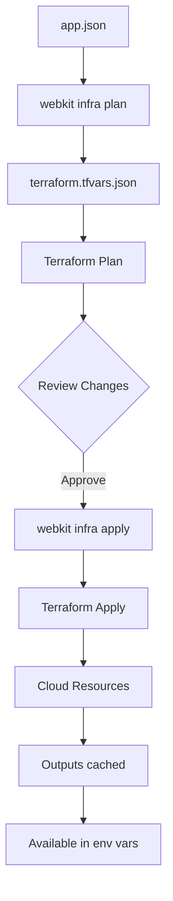

# Core concepts

This page explains the philosophy and architecture behind WebKit, helping you understand how it transforms a single manifest into production-ready infrastructure.

## Philosophy: Single source of truth

WebKit is built around one core principle: **your entire project configuration should live in a single file**.

Traditional web projects scatter configuration across dozens of files:
- CI/CD workflows in `.github/workflows/`
- Docker configuration in `Dockerfile` and `docker-compose.yml`
- Infrastructure as Terraform files
- Environment variables in `.env` files
- Build configuration in `package.json`, `turbo.json`, etc.

WebKit consolidates all of this into `app.json`. When you run `webkit update`, it generates everything else automatically.

## How WebKit works



1. **app.json** - You define your project, apps, resources, and environments
2. **WebKit CLI** - Parses and validates your manifest
3. **Scaffold Engine** - Generates files from templates with tracking
4. **Infra Generator** - Converts your manifest to Terraform variables
5. **Terraform** - Provisions cloud infrastructure

## Manifest tracking

WebKit tracks every file it generates in `.webkit/manifest.json`. This enables:

### Idempotent updates

Running `webkit update` multiple times produces the same result. WebKit:
1. Reads the previous manifest
2. Generates new files
3. Compares with previous state
4. Only writes changed files
5. Removes orphaned files

### Drift detection

WebKit stores content hashes for all generated files. When you run `webkit drift`, it compares current files against stored hashes to detect manual modifications.

```bash
webkit drift
```

If you've edited a generated file, WebKit warns you before overwriting.

### Source attribution

Each tracked file records:
- **Generator** - Which WebKit component created it (e.g., `cicd.ReleaseWorkflow`)
- **Source** - What caused generation (e.g., `app:web`)
- **Hash** - SHA256 of file contents
- **Mode** - Whether the file is overwritable or user-editable

## Generated vs scaffolded files

WebKit distinguishes between two types of files:

| Type | Behaviour | Example |
|------|-----------|---------|
| **Generated** | Always overwritten on `webkit update` | GitHub workflows, Terraform vars |
| **Scaffolded** | Only created if missing, never overwritten | `.env.example`, initial configs |

Scaffolded files are meant for you to customise. WebKit won't touch them after initial creation.

## Environment variable resolution

WebKit supports three sources for environment variables:

### Static values

Plain text values defined directly in your manifest:

```json
{
  "PUBLIC_API_URL": {
    "source": "value",
    "value": "https://api.example.com"
  }
}
```

### SOPS secrets

Encrypted values stored in SOPS files:

```json
{
  "DATABASE_PASSWORD": {
    "source": "sops",
    "path": "db_password"
  }
}
```

WebKit decrypts these at build time using Age encryption.

### Resource outputs

Values from Terraform outputs (e.g., database connection strings):

```json
{
  "DATABASE_URL": {
    "source": "resource",
    "value": "postgres.connection_url"
  }
}
```

These are resolved after `webkit infra apply` runs.

## Infrastructure lifecycle

WebKit wraps Terraform for infrastructure management:



### State management

Terraform state is stored remotely in an S3-compatible backend (typically DigitalOcean Spaces). This enables:
- Team collaboration
- State locking to prevent conflicts
- Secure storage of sensitive state data

### Resource imports

Existing cloud resources can be imported into WebKit management:

```bash
webkit infra import
```

This runs `terraform import` for each resource, bringing them under WebKit's control without recreating them.

## Monorepo structure

WebKit is designed for monorepo projects. A typical structure:

```
project/
├── apps/
│   ├── web/          # SvelteKit frontend
│   └── cms/          # Payload CMS
├── packages/
│   └── shared/       # Shared code
├── resources/
│   └── secrets/      # SOPS-encrypted secrets
├── app.json          # WebKit manifest
├── package.json      # Root package
├── pnpm-workspace.yaml
└── turbo.json
```

Each app in `app.json` maps to a directory in `apps/`. WebKit generates appropriate build and deploy pipelines for each.

## Comparison with alternatives

| Feature | WebKit | Manual Setup | Platform-specific |
|---------|--------|--------------|-------------------|
| Single config file | Yes | No | Varies |
| Multi-provider support | Yes | N/A | No |
| Generated CI/CD | Yes | Manual | Platform-only |
| Infrastructure as code | Terraform | Your choice | Platform-managed |
| Secret management | SOPS/Age | Your choice | Platform-specific |
| Drift detection | Yes | No | No |
| Monorepo support | Yes | Manual | Limited |

WebKit gives you the simplicity of a platform (like Vercel or Railway) with the flexibility of custom infrastructure.

## Next steps

Now that you understand WebKit's architecture:

- Explore the [manifest reference](/manifest/overview) for all configuration options
- Learn about [app configuration](/manifest/apps) in detail
- Set up [infrastructure providers](/infrastructure/overview) for deployment
