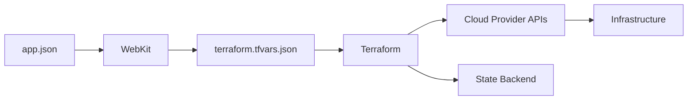

# Infrastructure overview

WebKit uses Terraform to provision and manage cloud infrastructure. This guide explains how infrastructure management works and how to use the `webkit infra` commands.

## How it works

WebKit acts as a wrapper around Terraform, converting your `app.json` manifest into Terraform variables and managing the execution lifecycle.



1. WebKit reads your `app.json` manifest
2. Generates `terraform.tfvars.json` with all configuration
3. Terraform consumes these variables
4. Provisions resources via cloud provider APIs
5. Stores state in a remote backend

## State management

Terraform state is stored remotely in an S3-compatible backend. This enables:

- **Team collaboration** - Multiple developers can work with the same infrastructure
- **State locking** - Prevents concurrent modifications
- **Secure storage** - State contains sensitive data and shouldn't be committed

WebKit supports DigitalOcean Spaces as the state backend. Configure it via environment variables:

```bash
export TF_STATE_BUCKET="your-bucket-name"
export TF_STATE_ACCESS_KEY="your-access-key"
export TF_STATE_SECRET_KEY="your-secret-key"
```

## Commands

### Plan changes

Preview what Terraform will do without making changes:

```bash
webkit infra plan
```

This runs `terraform plan` and shows:
- Resources to be created
- Resources to be modified
- Resources to be destroyed

Always review the plan before applying.

### Apply changes

Provision or update infrastructure:

```bash
webkit infra apply
```

This runs `terraform apply` with auto-approval. WebKit handles:
- Variable generation from `app.json`
- State backend configuration
- Output caching for environment variables

### Destroy infrastructure

Remove all provisioned resources:

```bash
webkit infra destroy
```

::: warning
This permanently deletes all infrastructure. Use with caution.
:::

### View outputs

Display Terraform outputs (cached from last apply):

```bash
webkit infra output
```

Outputs include resource values like:
- Database connection strings
- Storage bucket URLs
- Domain configurations

These are used to populate environment variables with `source: resource`.

### Import existing resources

Bring existing cloud resources under WebKit management:

```bash
webkit infra import
```

WebKit analyses your manifest and imports matching resources into Terraform state. This is useful when:
- Migrating an existing project to WebKit
- Resources were created manually
- Recovering from state corruption

### Execute Terraform directly

Run arbitrary Terraform commands:

```bash
webkit infra exec -- state list
webkit infra exec -- console
```

Use this for advanced operations not covered by WebKit's commands.

## Supported providers

WebKit supports multiple infrastructure providers:

| Provider | Resources | Use case |
|----------|-----------|----------|
| [DigitalOcean](/infrastructure/providers/digital-ocean) | Apps, Droplets, Postgres, Spaces | Primary hosting |
| [Hetzner](/infrastructure/providers/hetzner) | VMs, Volumes | Cost-effective VMs |
| [Backblaze B2](/infrastructure/providers/backblaze-b2) | Object storage | Affordable storage |
| [Turso](/infrastructure/providers/turso) | SQLite databases | Edge databases |
| [Slack](/infrastructure/providers/slack) | Notifications | Alert channels |

## Provider authentication

Each provider requires authentication via environment variables:

### DigitalOcean

```bash
export DIGITALOCEAN_ACCESS_TOKEN="your-token"
```

### Hetzner

```bash
export HCLOUD_TOKEN="your-token"
```

### Backblaze B2

```bash
export B2_APPLICATION_KEY_ID="your-key-id"
export B2_APPLICATION_KEY="your-key"
```

### Turso

```bash
export TURSO_API_TOKEN="your-token"
export TURSO_ORG_NAME="your-org"
```

## Module structure

WebKit's Terraform configuration is organised into:

- **Base** - Root configuration and backend setup
- **Modules** - Orchestration for apps, resources, and monitoring
- **Providers** - Provider-specific resource implementations

The CLI references these modules via GitHub releases, ensuring version consistency.

## Best practices

### Always plan first

Never run `webkit infra apply` without reviewing the plan:

```bash
webkit infra plan
# Review changes
webkit infra apply
```

### Use separate environments

Configure different Terraform workspaces for staging and production:

```bash
# Staging
export TF_WORKSPACE="staging"
webkit infra apply

# Production
export TF_WORKSPACE="production"
webkit infra apply
```

### Secure your credentials

Never commit provider tokens or state backend credentials:
- Use environment variables
- Store secrets in your CI/CD platform
- Consider using a secrets manager

### Back up state

Although state is stored remotely, consider periodic backups:

```bash
webkit infra exec -- state pull > backup.tfstate
```

## Troubleshooting

### State lock errors

If you see "Error acquiring the state lock":

```bash
webkit infra exec -- force-unlock LOCK_ID
```

### Resource already exists

If Terraform reports a resource already exists:

```bash
webkit infra import
```

This imports the existing resource into state.

### Provider authentication failures

Verify your environment variables are set correctly:

```bash
echo $DIGITALOCEAN_ACCESS_TOKEN
```

Ensure tokens have the required permissions.

## Next steps

- Configure [DigitalOcean](/infrastructure/providers/digital-ocean) resources
- Set up [monitoring](/manifest/monitoring) for your applications
- Learn about [environment variables](/manifest/environment-variables) with resource outputs
